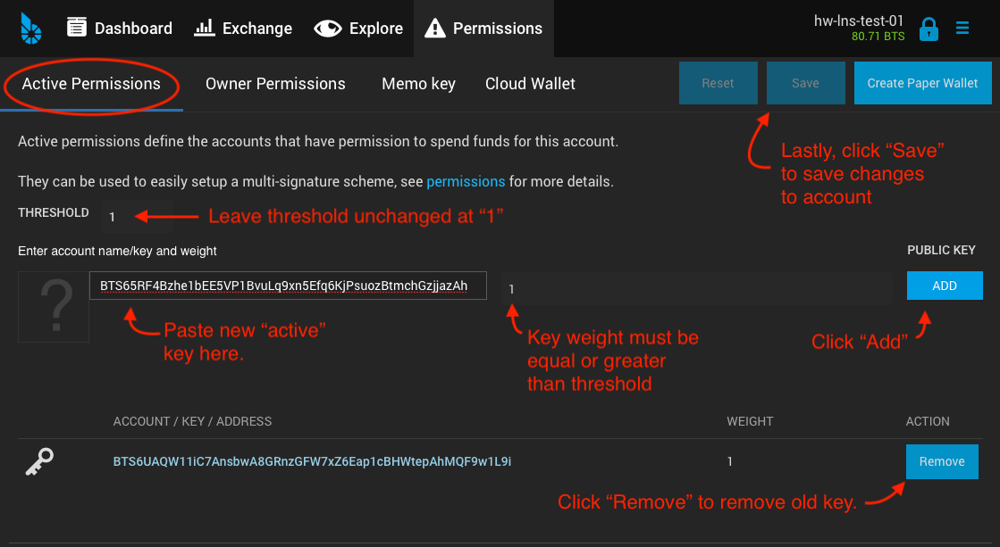

Securing BitShares with Ledger Nano
***********************************

Your BitShares account can be secured by a `Ledger Nano S hardware wallet <https://shop.ledger.com/products/ledger-nano-s>`_.  Hardware wallets secure crypto assets by protecting private keys. Transaction signing occurs on the hardware device itself, rather than on a host computer, isolating keys from exposure to malware or other threats.

.. contents:: **Contents:**
    :depth: 2

Requirements:
=============

* A Ledger Nano S hardware wallet, with latest firmware.
* An existing BitShares account (optional).
* Ledger-aware wallet software, such as SimpleGUIWallet (described below), for managing your hardware-secured BitShares accounts.

Installation and Setup:
=======================
This section covers installation of the BitShares app on the Ledger Nano S hardware device, and the installation of the companion GUI wallet app called SimpleGUIWallet for managing your hardware-secured BitShares accounts from a host computer running Windows, OS X, or Linux.

Installation of BitShares app from Ledger Live:
-----------------------------------------------

The BitShares App for Ledger Nano can be installed on your Ledger Nano S device from a host computer via the `Ledger Live <https://shop.ledger.com/pages/ledger-live>`_ device managemnt app.
1. Select the "Manager" tab from the menu in Ledger Live.
2. Search for the BitShares app in the App Catalog.
3. Click "Install" to install the BitShares app, following on-screen instructions

.. figure:: ledger_nano/Ledger_Manager.png
    :width: 600px
    :align: center
    :alt: Ledger Live Manager screen
    :figclass: align-center
    
    Ledger Live "Manager" tab, showing installation of BitShares app.
    
.. figure:: ledger_nano/01_Dashboard_800.jpg
    :width: 600px
    :align: center
    :alt: Ledger Nano S Dashboard
    :figclass: align-center
    
    Ledger Nano S Dashboard showing BitShares app installed.
    
Installing SimpleGUIWallet companion app on host computer:
----------------------------------------------------------

A companion app, compatible with Windows, Mac, and Linux, for communicating with the the BitShares Nano app, is available from: (Download location TBD)

    
    BitShares SimpleGUIWallet desktop companion app for Ledger Nano S BitShares app.

Securing a BitShares Account with the Ledger Nano:
==================================================

BitShares accounts work differently from Bitcoin wallets in that a named account must be registered on the BitShares blockchain.  The account will declare one or more public keys to act as "authorities" capable of signing transactions.

BitShares accounts are very capable and flexible.  The platform supports over 40 operation types.  The most commonly used operations center around trading on the decentralized exchange (DEX), and of course simple transfers of tokens.  The BitShares "Reference" UI wallet (web wallet: https://wallet.bitshares.org; standalone wallet: https://github.com/bitshares/bitshares-ui/releases) supports the full functionality of a BitShares account.  By contrast, the Ledger Nano BitShares app is primarily geared towards simple transfers and holding of tokens, although it is technically capable of signing any operation type.

This tutorial assumes that you already have an existing BitShares account for use in a standard, full-featured BitShares UI, and that you will be creating a new, separate account, to hold tokens secured by your Ledger Nano S hardware wallet device.  Essentially, we assume your existing account will be the "hot wallet," and the new account will be your hardware-secured "cold wallet."

Step 1: Create an account to associate with the Nano:
-----------------------------------------------------

If you already have a BitShares account and it has "lifetime membership" status, you can easily create a new account by selecting "Create Account" from the main drop-down menu ("Burger" menu) in the upper-right corner of the Reference UI.

If you do not already have a BitShares account, or if your account does not have lifetime-membership status, then you can use either the standalone wallet or one of the web-hosted wallets (e.g. https://wallet.bitshares.org) to register the account, and a faucet will pay the registration fee for you. A tricky thing though is that most such wallets will only pay the registration fee for ONE account per wallet instance.  So if you used the standalone wallet to register your primary account, then you may wish to use the web-hosted wallet to register your new account, or vice-versa.  Or you can use load the web wallet from a different device, or a different browser, to get back to the faucet-subsidized account registration screen.

.. figure:: ledger_nano/Account_Create.png
    :width: 600px
    :align: center
    :alt: Account Create form in BitShares UI
    :figclass: align-center
    
    Account Create form in the BitShares reference UI Wallet.

Once you have created this account, you will next need to retrieve **two** public keys from your Ledger Nano S hardware wallet, and set them as your account's "owner" and "active" authories.  Once the original account keys are removed and replaced with these new keys, the account will be controlled solely by the Ledger Nano S hardware device.

Step 2: Get Public Keys from the Ledger Nano:
---------------------------------------------

A BitShares account specifies two types of authorities: "Owner," and "Active," which each declare a weighted list of public keys needed to sign transactions. (The weights allow for multisignature arrangements to be created.  Here we will only consider a single key per authority.)  For the majority of transaction types, either the "owner" authority or the "active" authority may sign the transaction.  Your newly-created account will have had default keys generated for it during registration.  We will replace these keys with public keys retrieved from the Ledger Nano device.  We do this as follows:

1. Start up the companion app, *SimpleGUIWallet*.
2. Connect your Ledger Nano S hardware wallet device, unlock with PIN code, and start the BitShares app.

   * The Nano should the BitShares logo and the words **Use wallet to view accounts**.

3. In the companion app, select the "Public Keys" tab from the main tab array.

   * The window will show listboxes of `SLIP-0048 <https://github.com/satoshilabs/slips/blob/master/slip-0048.md>`_ derivation paths for three different "roles": Owner role, Active role, and Memo role.
   * (Note: SLIP-0048 is a key derivation scheme analogous to Bitcoin's BIP-44, but tailored for the key roles used in Graphene-based blockchains such as BitShares.)
   * Each path will not yet show a public key, but instead will show "(??)".

4. Click the "Query Addresses" button to retrieve the public keys corresponding to each derivation path from the Nano device.

   * The list boxes will now be populated with paths and public keys.
  
.. figure:: ledger_nano/Public_Keys_Tab_Annotated.png
    :width: 600px
    :align: center
    :alt: Public Keys Tab in Companion App
    :figclass: align-center
    
    The Public Keys tab can be used to list public keys controlled by the Ledger Nano device, organized by derivation path.

5. Now we wish to select one key to use for our account's Owner role and one for the Active role.  You may of course choose any key, but the recommendation is to choose the first key on the "Owner role" list (path 48'/1'/0'/0'/0') for the owner authority and the first key from the "Active role" list (path 48'/1'/1'/0'/0') for the active authority.  When an item from the listbox is selected, the public key appears in the PubKey box at the top of the window, where it can be copied to your computer's clipboard.

Step 3: Confirm keys on Ledger Nano device:
-------------------------------------------

It is highly recommended to *confirm* your selected keys on the Ledger Nano device prior to importing them as authorities into your new BitShares account.  This is to ensure that the *SimpleGUIWallet* companion app has not been tampered with to give you a decoy key.  Confirm keys as follows:

1. In the "Public Keys" tab of *SimpleGUIWallet*, query addresses as in the subsection above.  Then select the key you wish to confirm from the list, and click the "Confirm Address" button.

2. On your Ledger Nano device, look to see that the device says "**Confirm public key**" and displays the exact same public key as you see in the _SimpleGUIWallet_ app.  If the keys do not match, DO NOT trust the key from _SimpleGUIWallet_.  If the keys do match, then you know that the Ledger Nano device can sign transactions using the key, and you may import the key into your account, as described in the next subsection.

Step 4: Add the keys to your new account:
-----------------------------------------

.. figure:: ledger_nano/Update_Keys_UI_Location.png
    :width: 80%
    :align: center
    :alt: Select "Settings" from main menu
    :figclass: align-center
    
    Keys are managed under Settings —> Accounts —> View Keys.

    
    Adding a new Active key and removing the old one.

Using the Companion app with Nano BitShares app:
================================================

Viewing account balances:
-------------------------

Receiving funds:
----------------

Sending funds:
--------------

Advanced usage:
---------------

Getting Support:
================

