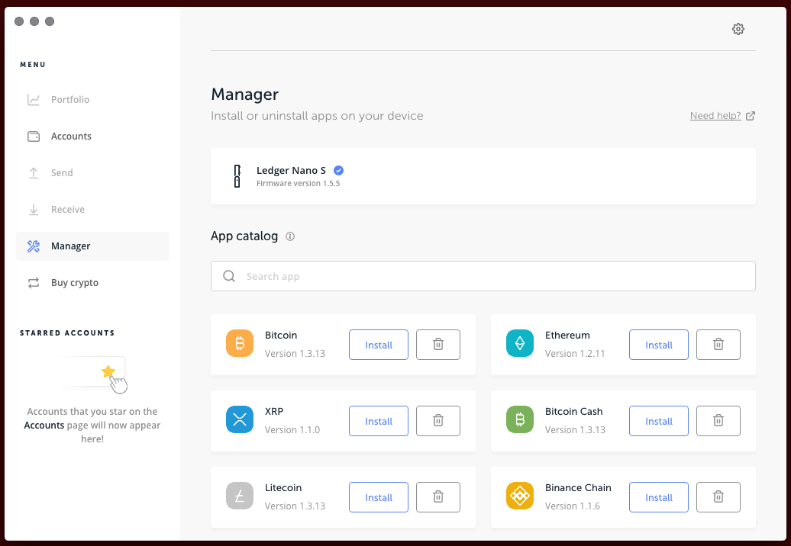

Securing BitShares with Ledger Nano
***********************************

Your BitShares account can be secured by a `Ledger Nano S hardware wallet <https://shop.ledger.com/products/ledger-nano-s>`_.  Hardware wallets secure crypto assets by protecting private keys. Transaction signing occurs on the hardware device itself, rather than on a host computer, isolating keys from exposure to malware or other threats.

.. contents:: **Contents:**
    :depth: 2

Requirements:
=============

* A Ledger Nano S hardware wallet, with latest firmware.
* An existing BitShares account (optional).
* Ledger-aware wallet software, such as SimpleGUIWallet (described below), for managing your hardware-secured BitShares accounts.

Installation and Setup:
=======================
This section covers installation of the BitShares app on the Ledger Nano S hardware device, and the installation of the companion GUI wallet app called SimpleGUIWallet for managing your hardware-secured BitShares accounts from a host computer running Windows, OS X, or Linux.

Installation of BitShares app from Ledger Live:
-----------------------------------------------

The BitShares App for Ledger Nano can be installed on your Ledger Nano S device from a host computer via the `Ledger Live <https://shop.ledger.com/pages/ledger-live>`_ device managemnt app.
1. Select the "Manager" tab from the menu in Ledger Live.
2. Search for the BitShares app in the App Catalog.
3. Click "Install" to install the BitShares app, following on-screen instructions

    
    Ledger Live "Manager" tab, showing installation of BitShares app.
    
.. figure:: ledger_nano/01_Dashboard_800.jpg
    :width: 600px
    :align: center
    :alt: Ledger Nano S Dashboard
    :figclass: align-center
    
    Ledger Nano S Dashboard showing BitShares app installed.
    
Installing SimpleGUIWallet companion app on host computer:
----------------------------------------------------------

A companion app, compatible with Windows, Mac, and Linux, for communicating with the the BitShares Nano app, is available from: (Download location TBD)

.. figure:: ledger_nano/Companion_App.png
    :width: 600px
    :align: center
    :alt: Companion App
    :figclass: align-center
    
    BitShares SimpleGUIWallet desktop companion app for Ledger Nano S BitShares app.

Using the Companion app with Nano BitShares app:
================================================

BitShares accounts work different from Bitcoin accounts in that a named account must be registered on the BitShares blockchain.  One or more public keys can then be assigned as the "authorities" of that account after registering, allowing a hardware wallet to "take over" a named account.  A BitShares account records two types of authorities: "owner," and "active."  Both the owner authority and the active authority can be used to sign the majority of transactions, but while the owner authority may change the keys that control the active authority, the active authoriry may NOT change the keys that control the owner authority.  This allows the owner authority keys to be kept as an account recovery safeguard.

BitShares accounts are also very capable and flexible.  The platform supports over 40 operation types.  The most commonly used operations center around trading on the decentralized exchange (DEX), and of course simple transfers of tokens.  The BitShares "Reference" UI wallet (web wallet: https://wallet.bitshares.org; standalone wallet: https://github.com/bitshares/bitshares-ui/releases) supports the full functionality of a BitShares account.

The Ledger Nano BitShares app is primarily geared towards simple transfers and holding of tokens, although it is technically capable of signing any operation type.

This tutorial assumes you will keep your primary BitShares account unchanged, for use in standard BitShares wallets, and will create a new, separate account, to hold funds secured by you Ledger Nano S hardware wallet device.

Creating an account and associating the Nano:
---------------------------------------------

Viewing account balances:
-------------------------

Receiving funds:
----------------

Sending funds:
--------------

Advanced usage:
---------------

Getting Support:
================

