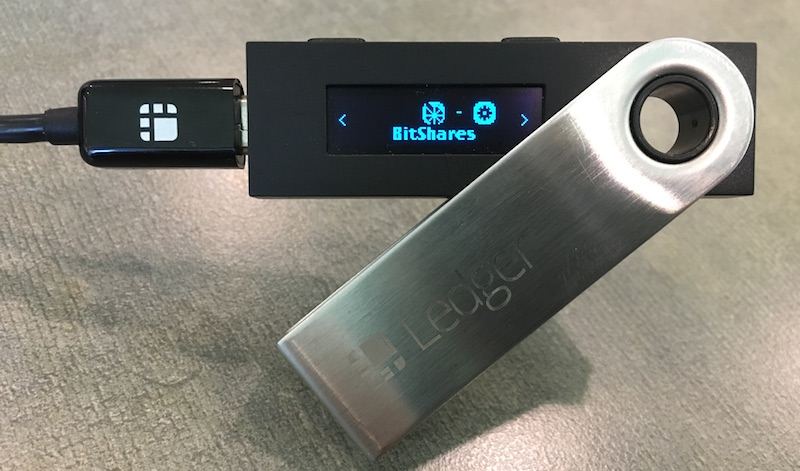

Securing BitShares with Ledger Nano
***********************************

Your BitShares account can be secured by a `Ledger Nano S hardware wallet <https://shop.ledger.com/products/ledger-nano-s>`_.  Hardware wallets secure crypto assets by protecting private keys. Transaction signing occurs on the hardware device itself, rather than on a host computer, isolating keys from exposure to malware or other threats.

.. contents:: **Contents:**
    :depth: 2

Requirements:
=============

* A Ledger Nano S hardware wallet, with latest firmware.
* An existing BitShares account (optional).
* Ledger-aware wallet software, such as SimpleGUIWallet (described below), for managing your hardware-secured BitShares accounts.

Installation and Setup:
=======================
This section covers installation of the BitShares app on the Ledger Nano S hardware device, and the installation of the companion GUI wallet app called SimpleGUIWallet for managing your hardware-secured BitShares accounts from a host computer running Windows, OS X, or Linux.

Installation of BitShares app from Ledger Live:
-----------------------------------------------

The BitShares App for Ledger Nano can be installed on your Ledger Nano S device from a host computer via the `Ledger Live <https://shop.ledger.com/pages/ledger-live>`_ device managemnt app.
1. Select the "Manager" tab from the menu in Ledger Live.
2. Search for the BitShares app in the App Catalog.
3. Click "Install" to install the BitShares app, following on-screen instructions

.. figure:: ledger_nano/Ledger_Manager.png
    :width: 600px
    :align: center
    :alt: Ledger Live Manager screen
    :figclass: align-center
    
    Ledger Live "Manager" tab, showing installation of BitShares app.
    

    
    Ledger Nano S Dashboard showing BitShares app installed.
    
Installing SimpleGUIWallet companion app on host computer:
----------------------------------------------------------

A companion app, compatible with Windows, Mac, and Linux, for communicating with the the BitShares Nano app, is available from: (Download location TBD)

.. figure:: ledger_nano/Companion_App.png
    :width: 600px
    :align: center
    :alt: Companion App
    :figclass: align-center
    
    BitShares SimpleGUIWallet desktop companion app for Ledger Nano S BitShares app.

Using the Companion app with Nano BitShares app:
================================================

BitShares accounts work differently from Bitcoin accounts in that a named account must be registered on the BitShares blockchain.  Public keys are then be added to the account to define "authorities" capable of signing transactions.

BitShares accounts are also very capable and flexible.  The platform supports over 40 operation types.  The most commonly used operations center around trading on the decentralized exchange (DEX), and of course simple transfers of tokens.  The BitShares "Reference" UI wallet (web wallet: https://wallet.bitshares.org; standalone wallet: https://github.com/bitshares/bitshares-ui/releases) supports the full functionality of a BitShares account.

The Ledger Nano BitShares app is primarily geared towards simple transfers and holding of tokens, although it is technically capable of signing any operation type.

This tutorial assumes you will keep your primary BitShares account unchanged, for use in standard BitShares wallets, and will create a new, separate account, to hold funds secured by you Ledger Nano S hardware wallet device.

Step 1: Create an account to associate with the Nano:
-----------------------------------------------------

If you already have a BitShares account and it has "lifetime membership" status, you can easily create a new account by selecting "Create Account" from the main drop-down menu ("Burger" menu).

If you do not already have a BitShares account, or if your account does not have lifetime-membership status, then you can use one of the web wallets (e.g. https://wallet.bitshares.org) to register the account, and a faucet will pay the registration fee for you. (If you find yourself unable to use the faucet because an account was already registered in that browser, then try loading the wallet in a different browser (Firefox, Chrome, etc.) that does not already have your account stored in its local data storage.  Or, you can clear browser data to "reset" the wallet — but be sure you have your private keys or login credentials for your primary account securely backed up!)

[image]

Once you have created this account, you will next need to retrieve two public keys from your Ledger Nano S hardware wallet, and set them as your account's owner and active authories.  Once the original account keys are removed and replaced with these new keys, the account will be controlled solely by the Ledger Nano S hardware device.

Step 2: Get Public Keys from the Ledger Nano:
---------------------------------------------

A BitShares account records two types of authorities: "owner," and "active."  Both the owner authority and the active authority can be used to sign the majority of transactions, but the active authority is prohibited from changing the owner authority, allowing the owner authority keys to be kept as an account recovery safeguard.  For this tutorial, we will retrieve two keys from the Nano to serve for both the Owner and Active authorities on our new account.

1. Start up the companion app, SimpleGUIWallet.
2. Connect your Ledger Nano S hardware wallet device, unlock with PIN code, and start the BitShares app.

   * The Nano should the BitShares logo and the words **Use wallet to view accounts**.

3. In the companion app, select the "Public Keys" tab from the main tab array.

   * The window will show listboxes of SLIP-0048 derivation paths for three different "roles": Owner role, Active role, and Memo role.
   * Each path will not yet show a public key, but instead will show "(??)".

4. Click the "Query Addresses" button to retrieve the public keys corresponding to each derivation path from the Nano device.

   * The list boxes will now be populated with paths and public keys.
  

    
    The Public Keys tab can be used to list public keys controlled by the Ledger Nano device, organized by derivation path.  

Step 3: Add the keys to your new account:
-----------------------------------------

Viewing account balances:
-------------------------

Receiving funds:
----------------

Sending funds:
--------------

Advanced usage:
---------------

Getting Support:
================

